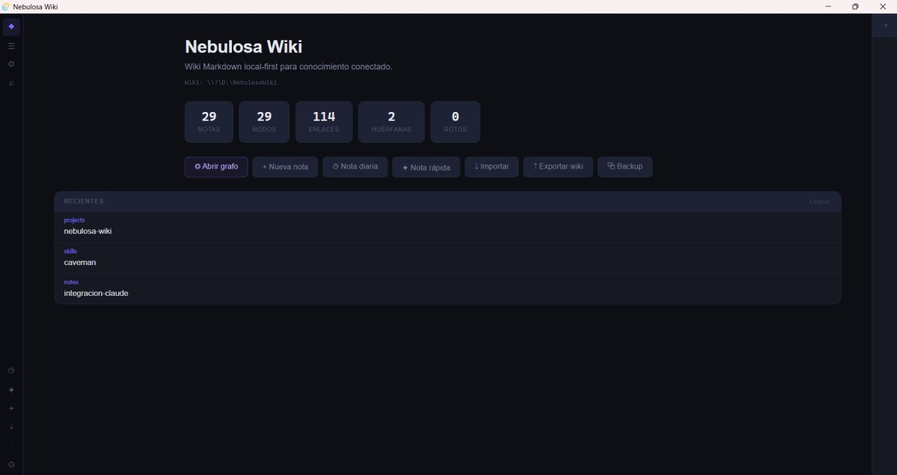
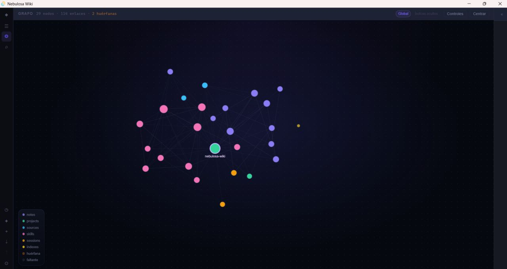
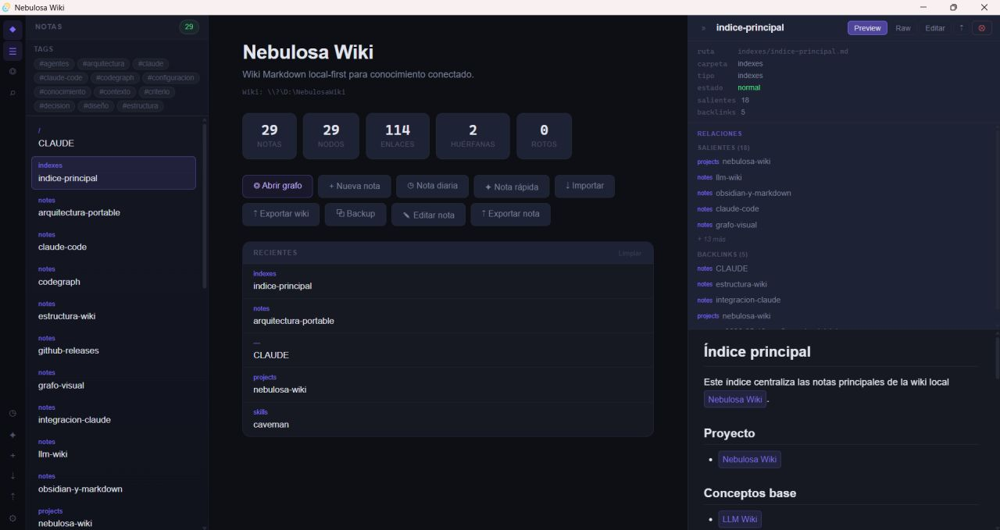

# Nebulosa Wiki

Nebulosa Wiki es una aplicación portable local-first para gestionar una wiki Markdown personal en Windows.

Está pensada para organizar conocimiento personal, notas conectadas, documentación técnica, sesiones de trabajo y flujos de integración con herramientas como Claude Code.

---

## Capturas

### Dashboard



### Grafo visual



### Editor Markdown



---

## Descargar

La versión portable está disponible en la sección de releases:

[Descargar Nebulosa Wiki Portable](https://github.com/AndreFGch/NebulosaWikiApp/releases/latest)

Archivo recomendado:

```txt
NebulosaWiki-Portable-v0.1.0.zip
```

No descargués los archivos automáticos de GitHub llamados `Source code (zip)` o `Source code (tar.gz)` si solo querés usar la aplicación. Esos archivos son para desarrolladores.

---

## Cómo usar la versión portable

1. Descargar `NebulosaWiki-Portable-v0.1.0.zip`.
2. Descomprimirlo en cualquier carpeta, USB, disco externo o nube.
3. Abrir la carpeta `NebulosaWiki-Portable`.
4. Ejecutar `Nebulosa Wiki.exe`.
5. Empezar a crear y organizar notas Markdown.

La aplicación no requiere instalación tradicional.

---

## Modo portable

Nebulosa Wiki está preparada para funcionar como aplicación portable:

- No requiere instalación tradicional.
- No usa `Program Files`.
- La configuración se guarda dentro de la misma carpeta portable.
- La wiki por defecto se guarda dentro de la misma carpeta portable.
- Los datos locales del WebView se guardan dentro de la misma carpeta portable.
- La carpeta de la wiki se puede cambiar desde Ajustes.

Estructura esperada después de ejecutar la app:

```txt
NebulosaWiki-Portable/
├─ Nebulosa Wiki.exe
├─ README-PORTABLE.txt
└─ data/
   ├─ settings.json
   ├─ wiki/
   └─ webview/
```

---

## Funcionalidades

- Crear, editar, guardar y eliminar notas Markdown.
- Plantillas para notas:
  - nota simple
  - proyecto
  - fuente
  - skill
  - sesión
  - índice
- Nota diaria y nota rápida.
- Grafo visual de notas con Cytoscape.js.
- Filtros del grafo por tipo de nota.
- Toggle Global/Local en el grafo para ver solo la nota seleccionada y sus vecinos directos.
- Wikilinks estilo `[[Nombre de nota]]`.
- Crear notas desde enlaces faltantes.
- Backlinks y enlaces salientes.
- Búsqueda por título, ruta, tag y contenido con normalización de acentos (árbol/arbol, André/Andre) y ranking de relevancia.
- Filtro por tags desde el sidebar.
- Historial de notas recientes.
- Importar archivos Markdown.
- Exportar nota individual.
- Exportar wiki completa.
- Backup manual de la wiki.
- Paleta de comandos con `Ctrl + P`.
- Toasts de confirmación para operaciones importantes.
- Ruta de wiki configurable desde Ajustes.
- Selectores nativos del sistema operativo para configurar ruta de wiki, importar Markdown, exportar nota, exportar wiki y backup.
- Indicador visual de cambios sin guardar en el panel de edición.
- Advertencia al navegar o recargar con cambios sin guardar.
- Recargar wiki manualmente para sincronizar cambios realizados desde editores externos.

---

## Atajos de teclado

| Atajo | Acción |
|---|---|
| `Ctrl + P` | Abrir paleta de comandos |
| `Ctrl + S` | Guardar nota en modo edición |
| `Esc` | Cerrar búsqueda, limpiar selección o salir de flujos secundarios según el contexto |

---

## Integración con Claude Code

Nebulosa Wiki puede usarse como base de conocimiento Markdown para trabajar con Claude Code.

Un flujo posible:

1. Crear o mantener una wiki local en Markdown.
2. Abrir esa carpeta con Claude Code.
3. Usar un archivo `CLAUDE.md` dentro de la wiki para definir reglas de trabajo.
4. Documentar decisiones, sesiones, prompts, skills y arquitectura.
5. Usar Nebulosa Wiki para visualizar relaciones, backlinks y grafo.

Ejemplo:

```powershell
cd "ruta-de-tu-wiki"
claude
```

---

## Requisitos para usar la app

- Windows 10 o Windows 11 de 64 bits.
- Microsoft Edge WebView2 Runtime disponible en el sistema.

En Windows 11 normalmente WebView2 ya viene incluido. En algunos equipos con Windows 10 podría ser necesario instalar WebView2 Runtime.

---

## Notas para Windows

Nebulosa Wiki se distribuye como aplicación portable para Windows.

Como el ejecutable no está firmado digitalmente todavía, Windows SmartScreen podría mostrar una advertencia al abrirlo por primera vez. Esto es común en aplicaciones independientes o proyectos open source sin certificado de firma.

Recomendación:

- Descargar siempre desde la sección oficial de Releases del repositorio.
- Verificar que el archivo descargado sea `NebulosaWiki-Portable-v0.1.0.zip` o la versión portable más reciente.
- Descomprimir el ZIP en una carpeta propia.
- Ejecutar `Nebulosa Wiki.exe`.

---

## Desarrollo local

Para trabajar con el código fuente necesitás:

- Node.js v18 o superior.
- Rust y Cargo.
- Visual Studio Build Tools 2022 con el componente **Desarrollo para el escritorio con C++**.
- WebView2 Runtime.

Clonar el repositorio:

```bash
git clone https://github.com/AndreFGch/NebulosaWikiApp.git
cd NebulosaWikiApp
npm install
```

Ejecutar en desarrollo:

```bash
npm run tauri:dev
```

Compilar versión release:

```bash
npm run tauri:build
```

Generar ZIP portable:

```powershell
.\scripts\build-portable.ps1
```

---

## Stack

| Capa | Tecnología |
|---|---|
| Shell de escritorio | Tauri 2 |
| Backend local | Rust |
| UI | React 19 + TypeScript |
| Grafo visual | Cytoscape.js |
| Markdown | react-markdown + remark-gfm |
| Búsqueda full-text | Rust |
| Configuración | JSON local |
| Distribución | ZIP portable para Windows |

Ver decisión técnica en [`ADR-0001.md`](ADR-0001.md).

---

## Estructura general

```txt
src/                 UI React + TypeScript
src-tauri/           Backend Tauri/Rust
scripts/             Scripts de desarrollo y build portable
CLAUDE.md            Reglas operativas para Claude Code
ADR-0001.md          Decisión arquitectónica inicial
README.md            Documentación principal
```

---

## Forma de trabajo

Este proyecto se desarrolló con una dinámica de cambios pequeños y controlados:

- Cambios incrementales.
- Validación con `npx tsc --noEmit`.
- Validación con `cargo check`.
- Separación entre app portable, código fuente y wiki personal.
- Cuidado de rutas locales y datos sensibles antes de publicar releases.

Ver reglas de trabajo en [`CLAUDE.md`](CLAUDE.md).

---

## Estado

Versión actual:

```txt
v0.1.0 Portable
```

Primera versión funcional publicada como aplicación portable para Windows.

---

## Limitaciones conocidas

- No tiene sincronización entre dispositivos.
- No tiene autosave automático todavía.
- No detecta automáticamente cambios hechos desde editores externos; se puede sincronizar manualmente con el botón Recargar wiki.
- No tiene firma digital de Windows.
- El rendimiento del grafo puede variar en wikis muy grandes.
- No reemplaza un sistema de backup externo; el backup manual ayuda, pero se recomienda mantener copias adicionales.

---

## Roadmap

Ideas futuras:

- Detección automática de cambios externos (file watcher).
- Backup comprimido en ZIP.
- Mejoras de rendimiento en wikis muy grandes.
- Grafo calculado en Rust con índice local.
- División del frontend en módulos separados.
- Configuración visual persistente.
- Más plantillas de notas.
- Tests E2E automatizados.
- CI para validación automática de builds.
- Integración más guiada con Claude Code.
